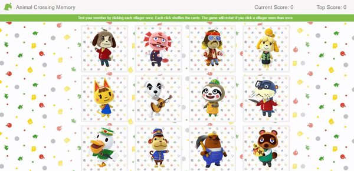

# Clicky Game

## Overview

Clicky-game is an Animal Crossing-themed memory game built with React. Twelve Animal Crossing characters are presented, and the user is tasked with clicking each character only once. Each click shuffles the order of the cards. If the user clicks the same character more than once, the game resets. 

